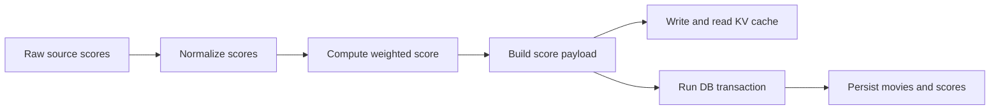

# Movies Ranking Public Core


Live site: [moviesranking.com](https://moviesranking.com)

This repo focuses on the engineering-heavy core:

- weighted multi-source scoring
- score normalization across incompatible source scales
- multi-layer caching primitives and KV TTL policy
- transactional persistence patterns for evolving source sets
- schema + migration history

## Why this repo exists

The full private app includes scraping/orchestration/admin operations. This public version isolates the parts that best demonstrate backend architecture and data-quality decision-making without exposing sensitive operational internals.

## Architecture at a glance



## Core modules

- `src/lib/normalize.ts`  
  Converts heterogeneous source scales to 0-100.
- `src/lib/scoring.ts`  
  Tiered weighted scoring with overlap-aware critic logic + Bayesian shrinkage.
- `src/lib/cache.ts`  
  Generic in-memory TTL cache utilities.
- `src/lib/kv.ts` + `src/lib/redis.ts`  
  L2 cache interface with adaptive TTL and graceful degradation.
- `src/db/schema.ts`  
  Drizzle schema and constraints.
- `src/db/persist.ts`  
  Transactional write path and score-row lifecycle invariants.

## Scoring system design

### 1) Normalization

`normalizeScore()` maps each source into a comparable 0-100 range:

- IMDb: non-linear boost curve above 7.0 (to reduce top-end compression)
- Letterboxd / RT Audience / AlloCiné: 0-5 -> 0-100
- Douban: 0-10 -> 0-100
- Metacritic / RT critics metrics: already 0-100

### 2) Weighted tiers

`computeOverallScore()` uses three tiers:

- Critics (default 50%)
- Cinephile (default 30%)
- Mainstream (default 20%)

Available lenses:

- `default`: 50 / 30 / 20
- `balanced`: 33.3 / 33.3 / 33.3
- `mainstream`: 20 / 30 / 50

### 3) Critic overlap handling

Critic score is not a naive average. It models overlap between critic sources:

- baseline: `rotten_tomatoes_all` (0.8) + `allocine_press` (0.2)
- elite premium: delta from baseline using
  - `rotten_tomatoes_top` (0.6)
  - `metacritic` (0.4)
- premium is clamped to +/-15 and dampened by `0.4`

If `rotten_tomatoes_all` is missing, fallback critic absolute blend is:

- `rotten_tomatoes_top` (0.55)
- `metacritic` (0.45)

### 4) Bayesian shrinkage

Small-sample sources are pulled toward a prior of `70`:

- `allocine_press`: `k=8`, full reliability at `30`
- `allocine_user`: `k=30`, full reliability at `1000`

### 5) Verdict gates and quality signals

- minimum 5 of 9 weighted sources required
- critic tier must be non-null
- returns `coverage` and `disagreement` (stddev of effective normalized scores)

## Caching architecture

### L1

`src/lib/cache.ts` provides in-memory TTL cache semantics for fast hot-path reads.

### L2 KV (Redis)

`src/lib/kv.ts` + `src/lib/redis.ts` provide:

- lazy singleton Redis client creation
- no-throw behavior when cache infra is unavailable
- versioned payload caching (`_v`) to avoid stale shape reads

### Adaptive TTL policy

`computeKvTtl()` chooses TTL by film age:

- `< 4 months`: 3 hours
- `4 months - 1 year`: 1 day
- `> 1 year`: 60 days
- fallback by release year when full date is unavailable

This prioritizes freshness for recent titles while minimizing churn for catalog titles.

## Persistence model and invariants

`persistScores()` in `src/db/persist.ts` is the core write path.

### Transaction semantics

Fresh writes are transactional and include:

1. upsert movie row by natural key (`imdb_id`)
2. delete existing score rows for that movie
3. insert current score set

The delete-then-insert strategy prevents orphaned/stale source rows when source availability changes over time.

### Backfill mode

Backfill writes use `onConflictDoNothing()` and a stale timestamp, so older cache data never overwrites fresher DB state.

### Historical preservation edge case

When `rotten_tomatoes_top` disappears from a new scrape, the persistence path can preserve an existing normalized value instead of dropping it.

## Data model

The schema is intentionally split:

- `movies`: denormalized, query-friendly aggregate fields
- `scores`: per-source rows keyed by `(imdb_id, source)`

This keeps ranking queries fast while preserving source-level provenance.

## Reliability patterns demonstrated

- graceful degradation (optional infra can be absent without hard failure)
- explicit score versioning (`CURRENT_SCORE_VERSION`)
- strict year parsing and payload mapping guards
- pure-function-heavy testable design

## Local setup

```bash
bun install
```

Optional env vars for DB/KV paths are documented in `.env.example`.

## Validation

```bash
bun run lint
bun run test
```

## Test coverage focus

Tests in this repo emphasize behavior and invariants:

- scoring math and lens behavior
- normalization transforms
- KV TTL/version/degradation behavior
- persistence transaction shape and edge-case handling
- score-version guardrails

## Scope notes

This public repo intentionally excludes:

- source scraping/fetch orchestration
- admin cache-bust/backfill endpoints
- private operational tasks and credentials

See `PUBLIC_SCOPE.md` for the curation boundary.
